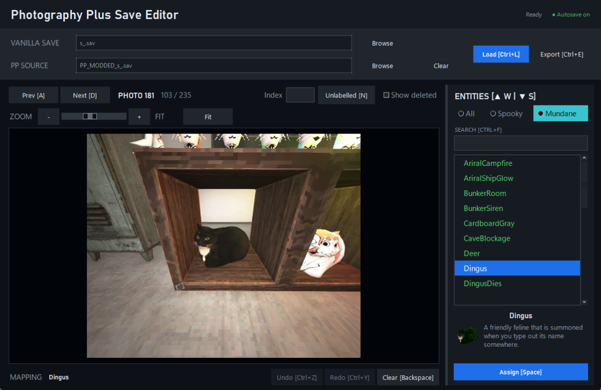

# Photography Plus Save Editor

A simple recovery tool for rebuilding Photography Plus photo-to-entity mappings
in Voices of the Void.

## Preview



Example with the mundane **Dingus** entry selected.

## Start

Double-click **Start Photography Plus Save Editor.bat**.

Python 3.10 or newer is required. On the first launch, the starter installs Pillow if it is
missing and then opens the editor. Nothing else needs to be configured.

You can also run it from a terminal:

```powershell
python run_editor.py
```

## Use

1. Choose the vanilla `s_[savename].sav` containing your photos.
2. Optionally choose a `PP_MODDED_[savename].sav` or online-editor JSON for old labels.
3. Click **Load**.
4. Browse photos, select an entity, and press **Space** to assign it.
5. Click **Export** and choose a new filename for the corrected PP save.

Progress is saved automatically. Deleted photo slots are hidden unless **Show
deleted** is enabled. They do not need to be labelled.

The editor never overwrites the selected template or live save. It writes a new
file and checks that the mappings can be read back before reporting success.

## Shortcuts

| Key | Action |
| --- | --- |
| `A` / `D` | Previous / next photo |
| `W` / `S` | Previous / next entity |
| `Space` | Assign entity and advance |
| `Backspace` | Clear mapping |
| `N` | Next unlabelled photo |
| `Ctrl+F` | Search entities |
| `Ctrl+Z` / `Ctrl+Y` | Undo / redo |
| `Ctrl+S` | Save progress |

## Folders

- `spoilers/entities.json` is the entity list used by the editor.
- `spoilers/entity_icons/` contains its bestiary preview images.
- `user_data/` contains extracted photos, progress, and remembered settings.
- `pplus_editor/` contains the application code.
